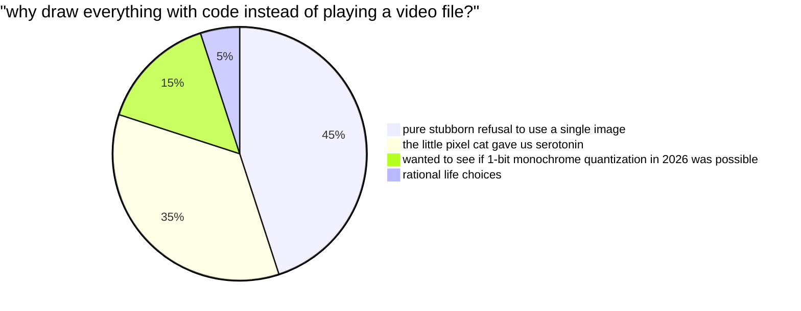
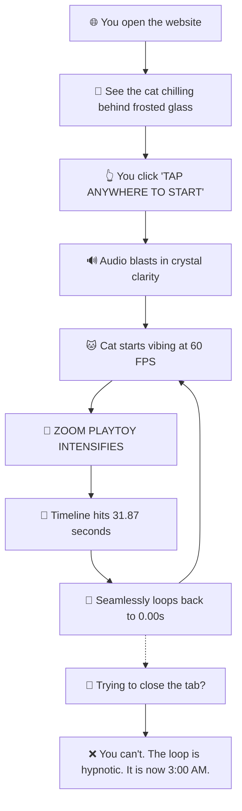
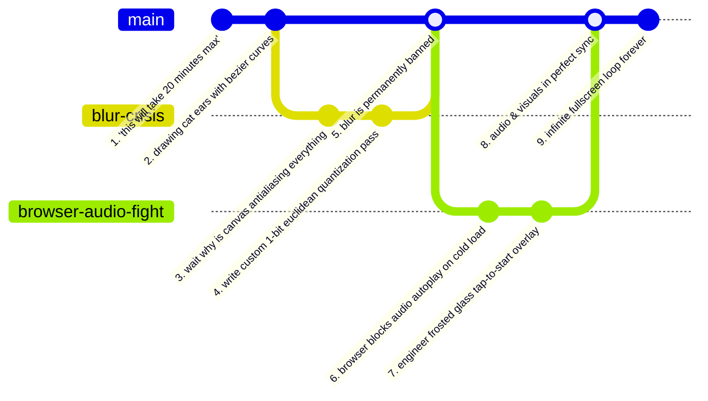

# bumblebee 🐝📟

> someone showed me a clip of a tiny cartoon cat dancing on an LCD screen and my brain decided: *yes, let's spend hours recreating the entire thing from scratch using pure canvas math and zero images.*

A 100% procedural, pixel-accurate web recreation of the iconic Bumblebee 128×64 monochrome LCD animation. No frameworks, no video clips, no image assets, no escape. Just code, a beat, and infinite looping.

---

## wait, why does this exist?

Normal people watch a cute retro LCD animation and think: *"wow, that's neat."*

We watched it and asked:
- *"What if we drew every single character frame using programmatic geometry?"*
- *"What if we engineered a custom 7×9 bitmap font rasterizer with intentional per-glyph baseline jitter?"*
- *"What if we locked the animation to the millisecond of an audio track?"*
- *"What if we deleted every button on screen and made it loop fullscreen forever?"*

So here we are.

---

## completely necessary charts & statistical analysis 📊

### 1. why did we do this?



---

### 2. user experience flowchart



---

### 3. bundle weight comparison

```
┌──────────────────────────────────────────────────────────────┐
│                  BUNDLE SIZE REALITY CHECK                   │
├───────────────────────────────┬──────────────────────────────┤
│ "lightweight" modern web app  │ █████████████████████ 450 MB │
│ an electron app with 1 button │ ████████████████████████ 1GB │
│ this entire procedural universe│ █ 0.5 MB (literally just mp3)│
└───────────────────────────────┴──────────────────────────────┘
```

---

### 4. developer emotional journey



---

## the brag sheet

- **Zero Image Files**: Literally not a single PNG, JPEG, SVG, or GIF was used in this project. If you inspect the network tab, the only thing downloaded is one audio track and some JavaScript. Every eyeball, whisker, mouth frame, tear drop, and text character is generated on the fly.
- **128 × 64 Logical Grid**: The entire world runs inside an authentic 128×64 dot-matrix coordinate space (the exact resolution of classic SSD1306 OLED / LCD displays) and scales up to whatever giant monitor you're using without losing its retro soul.
- **Banned the Blur**: Browsers love smoothing out pixels with antialiasing. We took that personally. A custom 1-bit monochrome quantization pass forcibly snaps every pixel to pure solid ink or pure LCD background. Zero blur. Zero gray edges. Razor sharp.
- **The Audio is the Boss**: The animation does not use a random interval timer that drifts out of sync after 10 seconds. The visual engine is a slave to `audio.currentTime`. Where the song goes, the cat follows.
- **26 Precise Timeline Scenes**: Hand-timed scene cuts matching every lyric change, pose shift, and bounce from `0.00s` to `31.87s`.
- **Fullscreen & UI-Free**: No headers. No progress bars. No pause buttons. No menus. When the page opens, it takes over your viewport in a clean 2:1 aspect ratio and loops into eternity.
- **0 Dependencies**: No React. No Vite. No Tailwind. No 500MB `node_modules` black hole. Just vanilla web standards running at a crisp 60 FPS.

---

## how it actually works

```
[ audio.mp3 ] ──(currentTime)──► [ Timeline Engine ]
                                         │
                                         ▼
                     [ 128×64 Offscreen Canvas Buffer ]
                     ├─ procedural characters (characters.js)
                     ├─ bitmap typography (typography.js)
                     └─ 1-bit monochrome snap (renderer.js)
                                         │
                                         ▼
                        [ Fullscreen Viewport Canvas ]
                       (crisp integer-scaled 2:1 ratio)
```

1. **Logical Offscreen Buffer**: Everything draws to an invisible 128×64 canvas first.
2. **Procedural Geometry**: Characters aren't spritesheets—they are procedural arcs, lines, and fill routines parameterized by time (`t`).
3. **Typography Engine**: Lyrics are rendered letter-by-letter using bitmap matrix lookup tables with subtle authentic vertical jitter.
4. **Quantization Pass**: The offscreen buffer runs through an ImageData scanner that binarizes every pixel against Euclidean distance to ink color.
5. **Upscaling**: The binarized frame is blown up to the presentation canvas using nearest-neighbor interpolation (`image-rendering: pixelated`).

---

## tech stack

| Component | Choice |
|---|---|
| Language | Pure JavaScript (ES Modules) |
| Graphics | HTML5 Canvas 2D Context |
| Styling | Vanilla CSS (Flexbox + `aspect-ratio: 2 / 1`) |
| State | `requestAnimationFrame` + `AudioClock` |
| Dependencies | `0` (we survived without npm install) |

---

## run it locally

You don't need a build pipeline. You just need any local web server to serve the ES modules:

```bash
# with python (built into mac/linux):
python3 -m http.server 3000

# or with npx:
npx serve .

# or with bun:
bunx serve .
```

Open `http://localhost:3000` and let the cat sing.

---

## deployment

It's completely static, so you can drop it onto:
- **Netlify** (a ready-to-go `netlify.toml` is included in the root)
- **GitHub Pages**
- **Vercel**
- Literally any bucket or potato server that knows how to serve an `index.html` file.

---

## disclaimer & credits

Created as a visual tribute and technical recreation of the beloved Bumblebee animated short. All audio and original character concepts belong to their respective original creators. Recreated purely out of passion for retro LCD aesthetics and programmatic graphics.

---

## license

This project is open source and available under the [MIT License](LICENSE).

